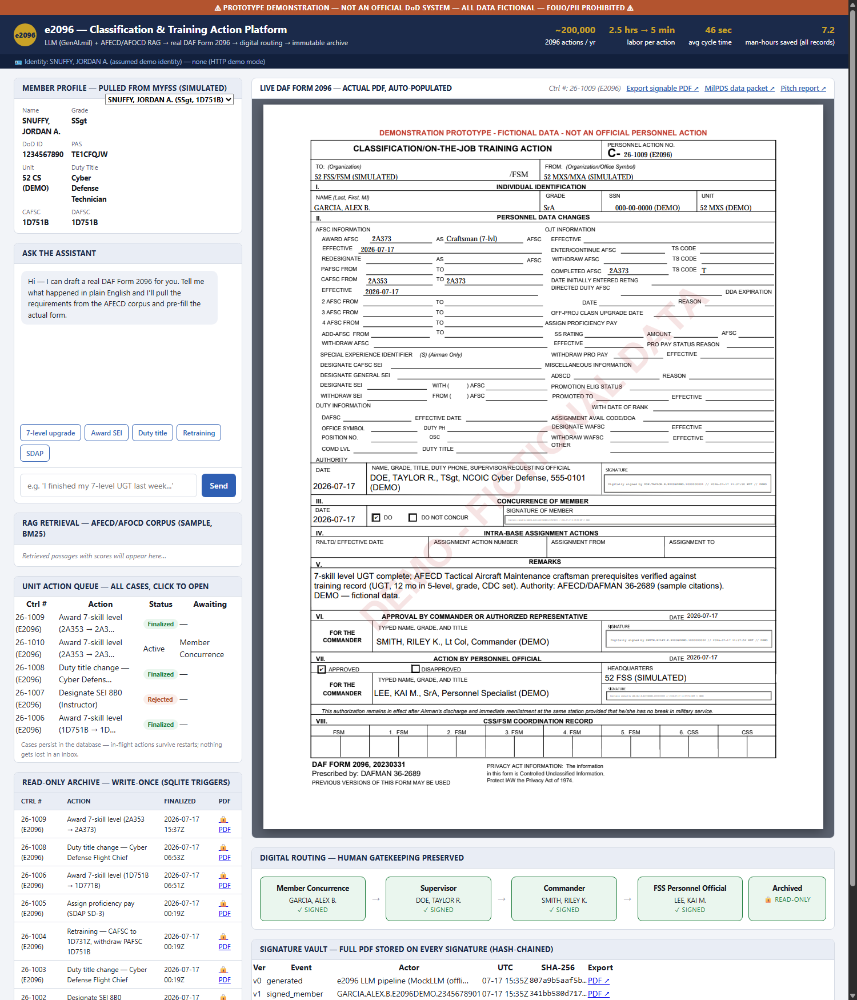
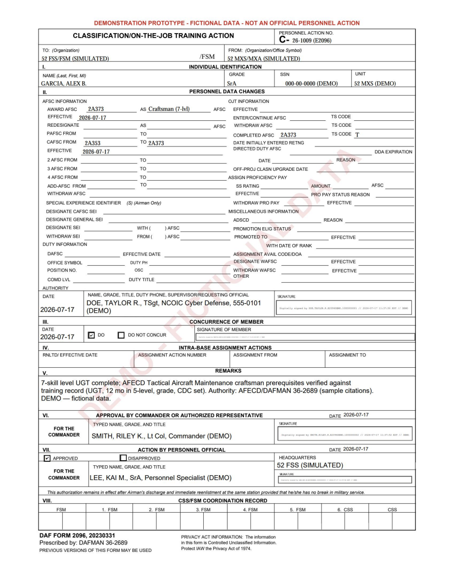
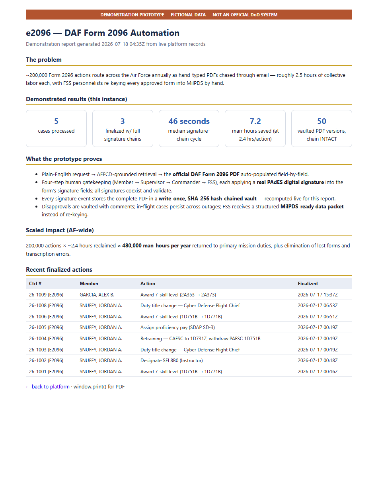

# e2096 — DAF Form 2096 Automation Platform (demonstration prototype)

> ⚠ **PROTOTYPE — NOT AN OFFICIAL DoD SYSTEM.** All member data is fictional; all
> AFECD/AFOCD passages are fictionalized samples. Every generated PDF is
> watermarked. Never load real PII or verbatim AFECD text into this demo.

Proof-of-concept for the SBIR pitch: an airman describes a personnel action in
plain English, an LLM grounded on an AFECD/AFOCD retrieval corpus derives the
correct classification action, and the platform fills the **actual DAF Form
2096 PDF** (20230331 template), routes it through human approvals, then
flattens and archives it write-once.

## Screenshots

**The platform** — plain-English request → AFECD-grounded retrieval → the live,
auto-populated official form → digital routing → hash-chained signature vault:



**A finalized DAF Form 2096** — four PAdES digital signatures (member
concurrence, supervisor, commander, FSS personnel official), every field
populated from the member profile and the derived action:



**The pitch report** (`/report`) — live metrics from the actual records:



## Run

```
pip install pypdf pypdfium2 reportlab pillow fastapi "uvicorn[standard]" pyhanko cryptography hypercorn
uvicorn server:app --port 8096 --app-dir e2096-platform
# open http://localhost:8096   (mTLS/CAC mode: see CAC_SIGNING.md)
```

## Records & signatures model

- **Real PAdES digital signatures.** Each approval fills that approver's blocks
  as a PDF *incremental update* (preserving earlier signatures) and signs the
  form's actual `/Sig` field with a demo-PKI certificate ([signing.py](signing.py),
  [formfill.py](formfill.py)). The supervisor's signature certifies the document
  with DocMDP FILL_FORMS permission; all three signatures coexist and validate
  (intact / valid / trusted) — `GET /api/case/{id}/signatures`.
- **Signature vault.** Every signature event stores the complete PDF as a blob
  in the write-once `versions` table, SHA-256 hash-chained to the previous
  version. `GET /api/ledger/verify` recomputes the whole chain (tamper
  evidence). UPDATE/DELETE are blocked by DB triggers.
- **Signable exports.** Any vaulted version keeps its remaining signature
  blocks as live `/Sig` fields — exportable and CAC-signable in Adobe/DoD
  eSign. See [CAC_SIGNING.md](CAC_SIGNING.md) for browser-CAC reality (mTLS)
  and the mTLS run mode.

## What each piece maps to in the Salesforce/myFSS build

| Demo component | Production equivalent |
|---|---|
| `scenarios.MockLLM` (deterministic keyword classifier) | GenAI.mil-hosted LLM, structured-output prompt (`GenAIMilAdapter` stub shows the contract) |
| `retrieval.Retriever` (BM25-lite over `corpus.json`) | Vector store over licensed AFECD/AFOCD text |
| Member profile constant | myFSS profile pull (Okta/CAC identity) |
| `pdf_engine.render_2096` (pypdf AcroForm fill + overlay stamps) | Salesforce flattened-PDF generation on approval |
| In-memory `CASES` + approve endpoint | Salesforce approval process objects (Supervisor → CC → FSS) |
| Demo CA in `pki/` + pyHanko PAdES seals | DoD PKI NPE certificate + platform signing service |
| `versions` vault (hash-chained blobs, write-once) | Immutable content store / WORM S3 |
| `flatten()` raster PDF + SQLite `archive` table with `RAISE(ABORT)` triggers | Read-only archive object / immutable content store |
| `archive/` PDFs | FSS action queue payload (pre-MilPDS-API staging) |

## Demo flow (5 scenarios)

7-level upgrade · SEI award · duty title change · retraining (CAFSC change +
PAFSC withdrawal pairing) · SDAP start. Each: chat → retrieved passages with
scores → filled 2096 preview (real PDF) → **four** signature steps (Member
concurrence → Supervisor → Commander → FSS), each a real PAdES signature →
flatten → read-only archive row.

## Workflow features

- **Member concurrence** is the first signature: it checks the DO box, dates
  Section III, and applies the member's certifying signature (DocMDP
  FILL_FORMS), authorizing the later fills/signatures.
- **Rejection** at any step vaults the disapproval + comment — the paper trail
  includes the "no" — and locks the case.
- **Unit action queue** (`/api/cases`): every case persists in SQLite with its
  current PDF; in-flight actions survive restarts and are resumable.
- **MilPDS data packet** (`/api/case/{id}/packet`): the structured, validated
  dataset the FSS gets instead of re-keying the form — the swivel-chair killer.
- **Live metrics** (`/api/metrics`): man-hours saved, median cycle time,
  case counts — computed from the actual records, not hardcoded.

## Tests

`python -m pytest tests/ -q` — 13 offline tests covering retrieval ranking,
intent classification, field-ID validity against the real template, appearance
wrapping, the sign-then-fill-then-sign chain, vault hash-chain math, and
control-number continuity.

## Notes

- The blank template (`templates/daf2096_blank.pdf`) is the official form; its
  LiveCycle XFA layer is stripped at fill time so the AcroForm is authoritative
  and renderable.
- The three `/Sig` fields can't hold text, so approvals are stamped as text
  overlays at the signature rects — native digital signatures in the real build.
- `e2096.db` and `archive/` are runtime artifacts; delete them to reset the demo.
